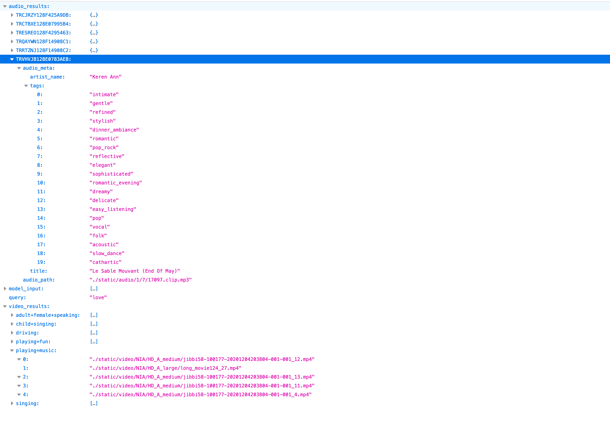

# NIA API
- input : Pharagraph (str)
- output : query, model_input, video_results, audio_results
    - query: 유저가 사용한 input pharagraph입니다. (str)
    - model_input : 결과로 나온 단어들의 List 입니다. (List of str)
    - video_results 
    - audio_results

### Folder
해당 레파지토리의 디렉토리는 다음과 같습니다.
- query_to_meta-api.py : Flask API 실행
- function.py : Detail Method 구현 문서
- requirements.txt : 사용 파이썬 라이브러리 정보
- static/audio : 워드 임베딩 모델/백터
- static/meta : MSD Path 정보 및 Audio meta, Tag Meta, Video Meta 정보
- static/video : NIA Highlight Video와 Moments Inference data
- static/vectors : Simiarilty Search에 필요한 벡터 데이터들

```sh
|-- extract_vectors.py
|-- functions.py
|-- query_to_meta-api.py
|-- requirements.txt
`-- static
    |-- audio
    |-- meta
    |   |-- 7D_id_to_path.pkl
    |   |-- MSD_id_to_7D_id.pkl
    |   |-- audio_meta.pkl
    |   |-- audio_tags.pkl
    |   `-- video_meta.csv
    |-- vectors
    |   |-- audio_tracks.pkl
    |   |-- video_tags.pkl
    |   `-- word_vectors.pkl
    `-- video
        `-- video_meta
```

#### Requirements
- python3.7
- Flask==1.1.2
- numpy==1.19.0
- pandas==1.0.3
- six==1.15.0

``` bash
pip install -r requirements.txt
```

### Usage (Python)

``` python
python query_to_meta-api.py
```
Flask 서버 실행 후, query에 input pharagrah 입력
```bash
http://127.0.0.1:5000/?query=
```


#### Example
love를 query로 사용한 케이스입니다.
```bash
http://127.0.0.1:5000/?query=love
```

#### Output
